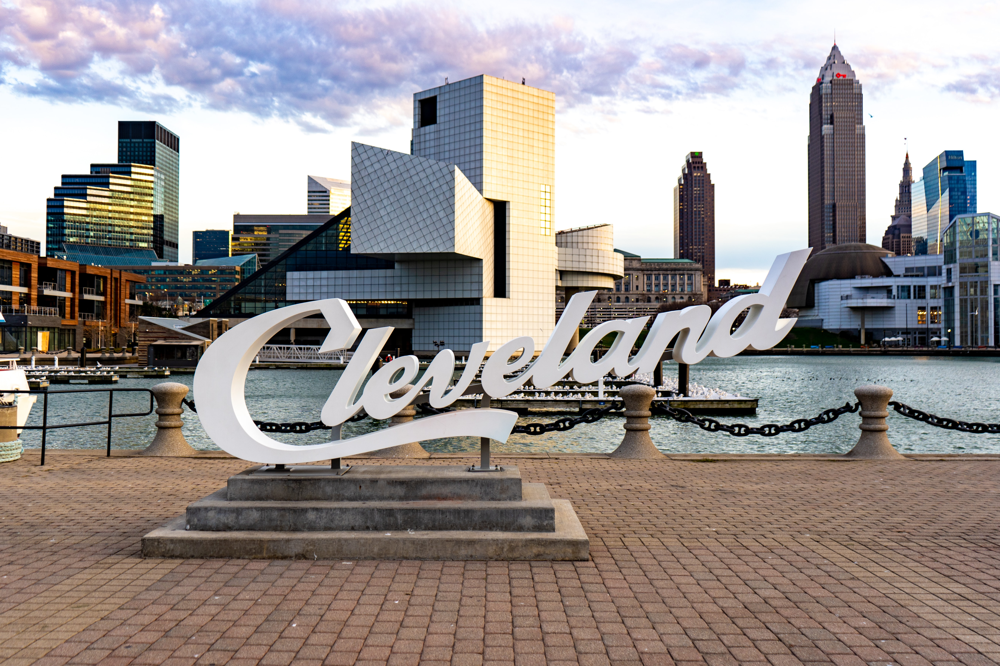

### Welcome! I'm Chris

> I am a new dev looking to learn and grow. So, take a look around, let me know what you think...and if you enjoy anything, please leave a star
>  

 

- 🔭 I’m currently working on my personal portfolio.
- 🌱 I’m currently learning Typescript
- 👯 I’m looking to collaborate with other developers, so we can grow
- 🤔 I’m looking for help with contributing to open source
- ⚡ Fun fact: I do yoga daily, working on holding a handstand for 30sec.

 

  
:satellite: Data

  
  

  

  

  

  

---

  

    <i>Lets grab some :coffee: and chat! Make something great! </i>
     
    
    
    
  

